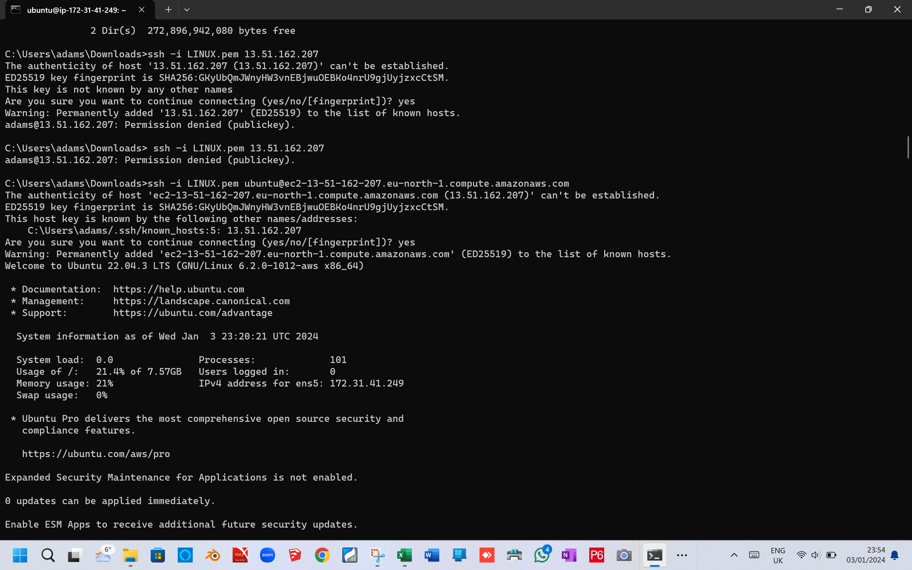
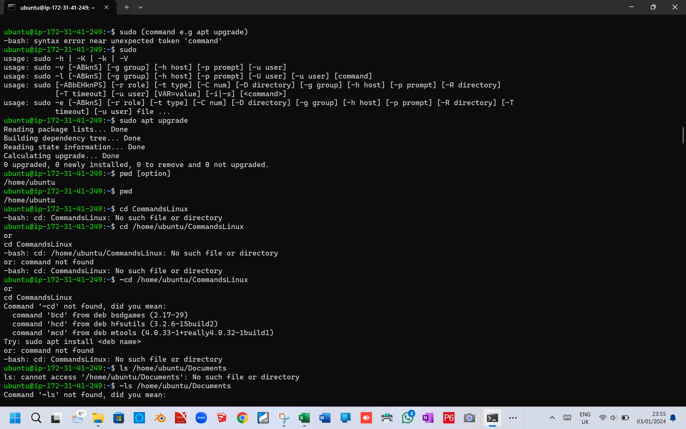
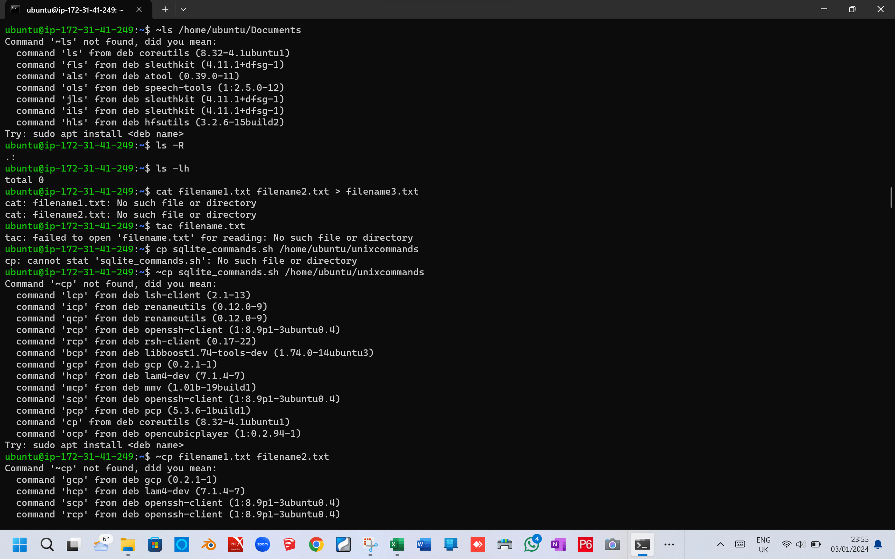
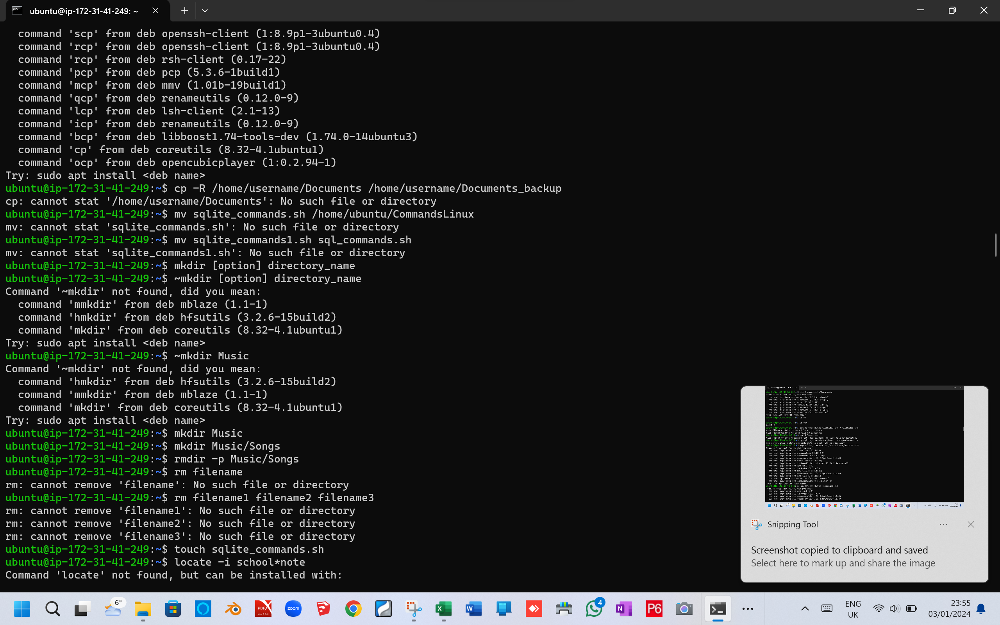
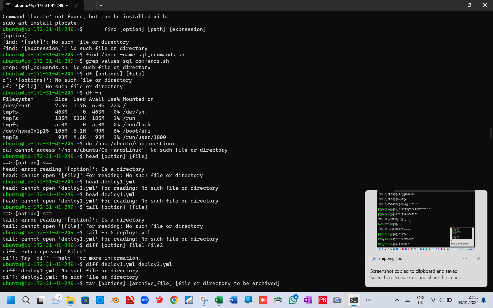
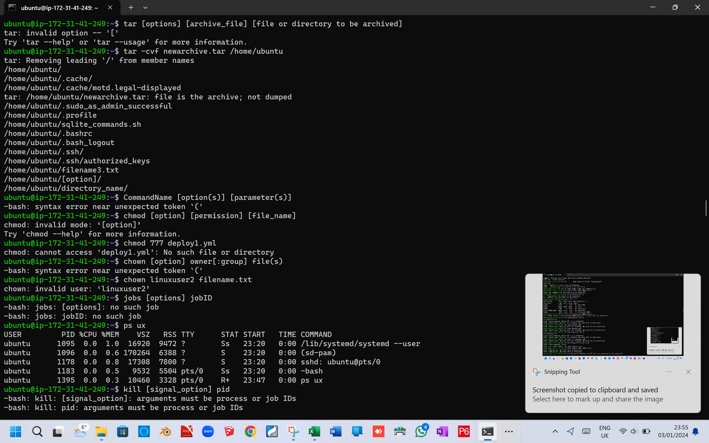

# GIT Project

This screenshot holds commands: sudo (command e.g apt upgrade), pwd.
 

This screenshot holds the commands: Suod, pwd, CommandsLinux and ls.

This screenshot holds the commands: ls, ls -R, ls -lh, cat and sudo apt.

THis screenshot holds the commands: LINUX.pem

This screenshot holds the commands: commands.sh, df -h. struggled a bit here

This screenshot holds commands: tar - kill

